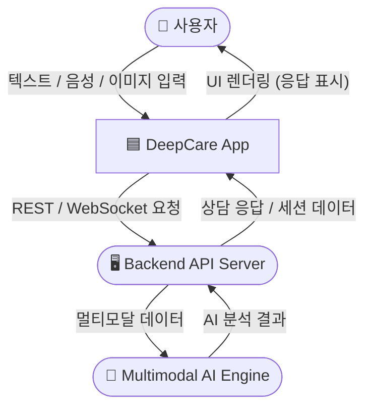
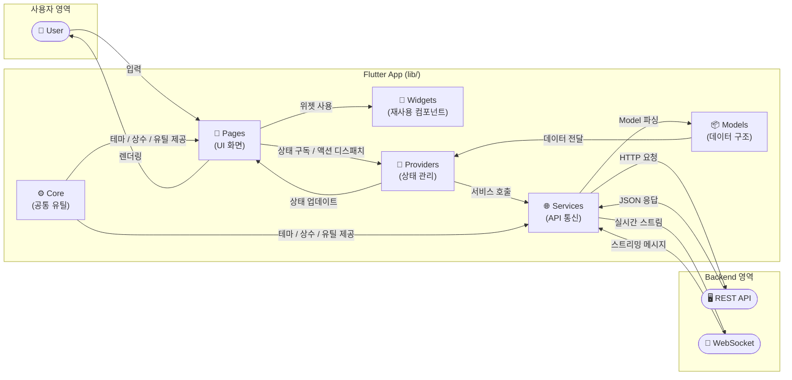
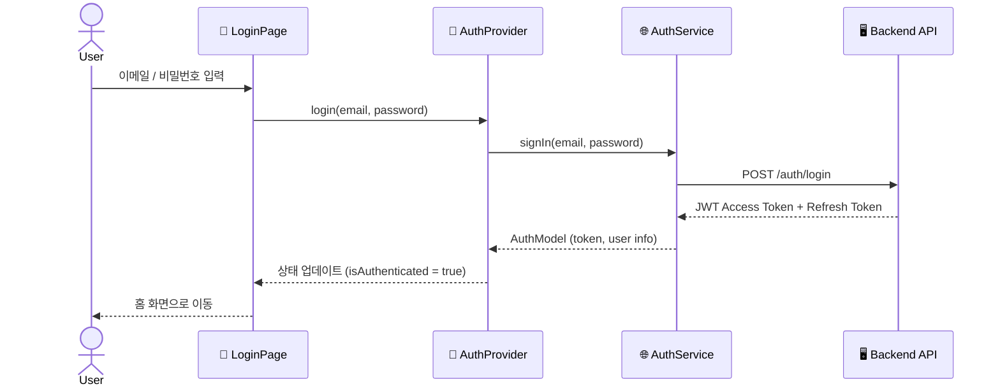
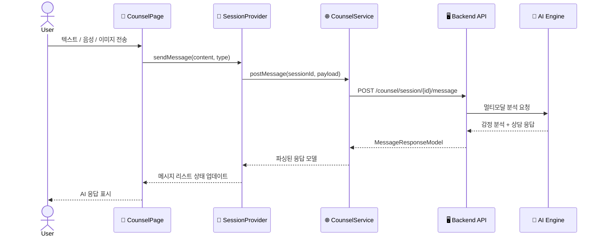
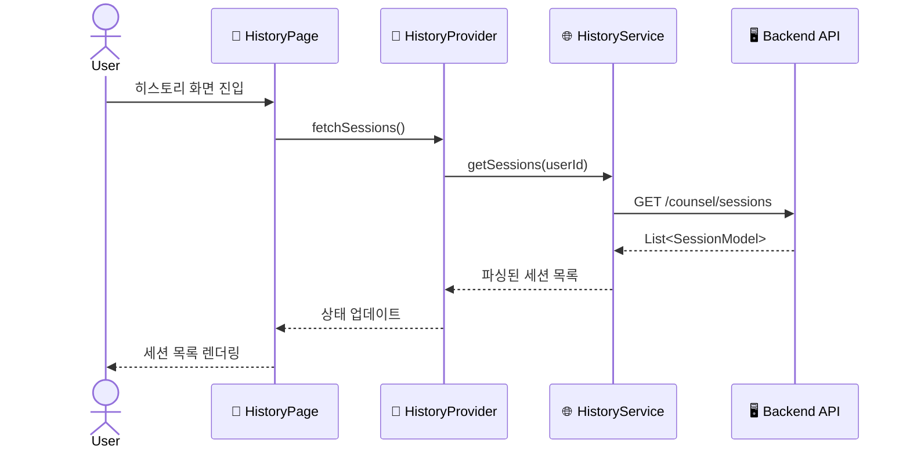

# DeepCare — Multimodal Counsel Client (Flutter)

> 멀티모달 AI 기반 심리 상담 모바일/웹 클라이언트

---

## 프로젝트 전체 데이터 흐름 (Level 0 — Context Diagram)



---

## Level 1 — 내부 레이어 데이터 흐름



---

## Level 2 — 주요 기능별 데이터 흐름

### 1. 인증 흐름 (Authentication)



### 2. 멀티모달 상담 흐름 (Counseling Session)



### 3. 세션 히스토리 흐름 (Session History)



---

## 디렉터리 구조

```
frontend/
├── lib/
│   ├── core/            # 공통 상수, 테마, 유틸리티
│   │   ├── constants/   # API URL, 앱 상수
│   │   ├── theme/       # 앱 테마 정의
│   │   └── utils/       # 헬퍼 함수
│   ├── models/          # 데이터 모델 (JSON 직렬화)
│   ├── pages/           # 화면 단위 Widget (라우트 대상)
│   ├── providers/       # 상태 관리 (Riverpod / Provider)
│   ├── services/        # 외부 API 통신 레이어
│   ├── widgets/         # 재사용 가능한 UI 컴포넌트
│   └── main.dart        # 앱 진입점
├── android/
├── ios/
├── web/
├── test/
└── pubspec.yaml
```

각 하위 폴더의 상세 흐름은 해당 폴더의 `README.md`를 참조하세요.
