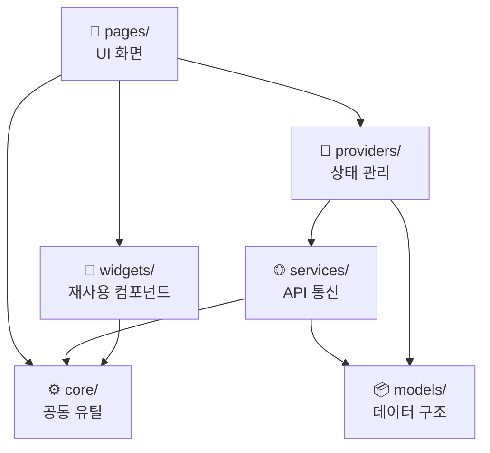

# lib/ — 소스코드 레이어 개요

이 디렉터리는 Flutter 앱의 모든 Dart 소스코드를 담습니다.
Clean Architecture 원칙에 따라 UI / 상태 / 비즈니스 / 데이터 레이어로 분리됩니다.

## 레이어 의존 방향

> **규칙**: 의존 방향은 항상 위에서 아래 방향입니다.  
> `models/`와 `core/`는 다른 레이어를 참조하지 않습니다.

## 각 폴더 역할

| 폴더 | 역할 | 외부 의존 |
|------|------|-----------|
| `pages/` | 화면 단위 Widget, 라우팅 대상 | providers, widgets, core |
| `widgets/` | 재사용 가능한 UI 컴포넌트 | core |
| `providers/` | 전역 / 로컬 상태 관리 | services, models |
| `services/` | HTTP / WebSocket 통신, 외부 API 래핑 | models, core |
| `models/` | JSON 직렬화 데이터 클래스 | 없음 |
| `core/` | 앱 전역 상수, 테마, 유틸 함수 | 없음 |
