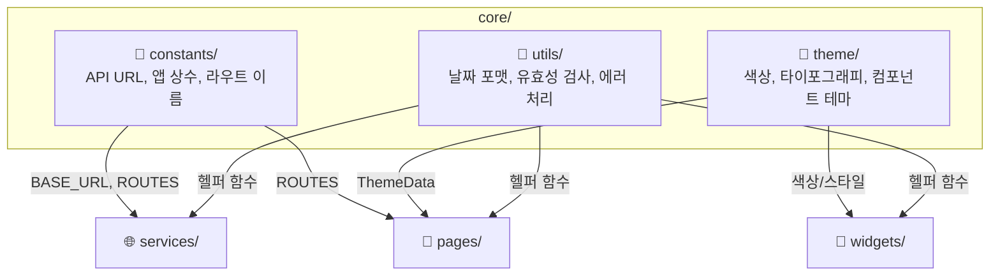
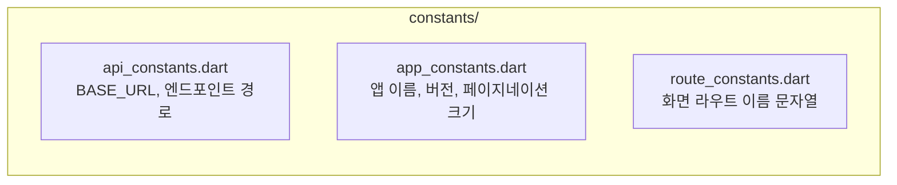
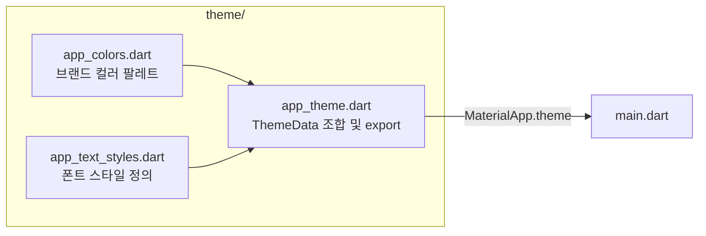
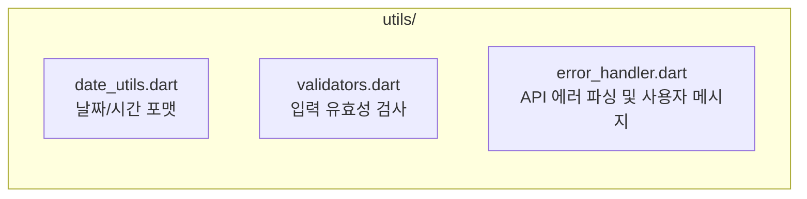

# core/ — 공통 기반 레이어

앱 전체에서 참조하는 상수, 테마, 유틸리티 함수를 제공합니다.  
다른 레이어에 의존하지 않으며, 모든 레이어가 이 폴더를 참조할 수 있습니다.

## core/ 내부 구조 및 흐름



## constants/ — 주요 상수



## theme/ — 앱 테마



## utils/ — 유틸리티 함수



## 폴더 구성 예시

```
core/
├── constants/
│   ├── api_constants.dart
│   ├── app_constants.dart
│   └── route_constants.dart
├── theme/
│   ├── app_colors.dart
│   ├── app_text_styles.dart
│   └── app_theme.dart
└── utils/
    ├── date_utils.dart
    ├── validators.dart
    └── error_handler.dart
```
