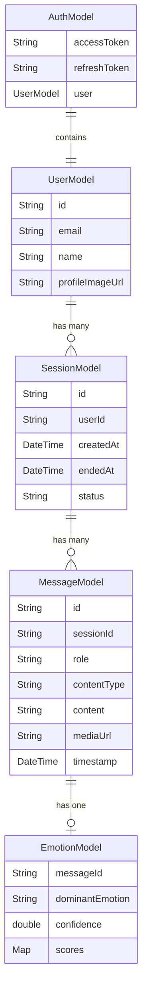
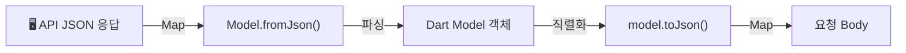

# models/ — 데이터 모델 레이어

API 응답을 Dart 객체로 매핑하는 데이터 클래스를 정의합니다.  
`fromJson` / `toJson`을 통해 직렬화/역직렬화를 처리합니다.

## 모델 간 관계



## JSON 직렬화 흐름



## 폴더 구성 예시

```
models/
├── auth_model.dart
├── user_model.dart
├── session_model.dart
├── message_model.dart
└── emotion_model.dart
```
