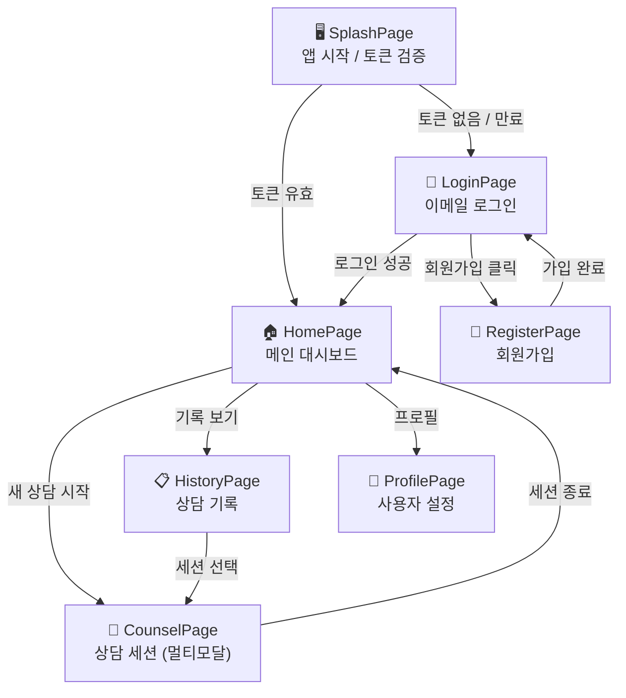
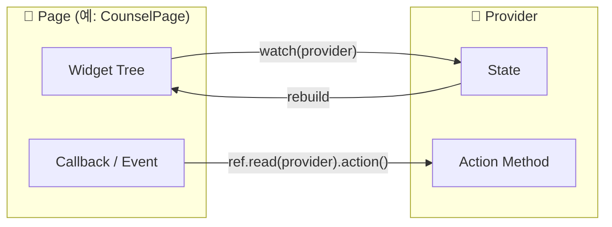

# pages/ — UI 화면 레이어

각 파일은 라우팅 가능한 독립 화면(Screen)입니다.  
화면은 `Providers`를 구독하여 상태를 읽고, 사용자 액션을 `Providers`로 전달합니다.

## 화면 간 네비게이션 흐름



## 각 화면의 데이터 흐름



## 폴더 구성 예시

```
pages/
├── splash/
│   └── splash_page.dart
├── auth/
│   ├── login_page.dart
│   └── register_page.dart
├── home/
│   └── home_page.dart
├── counsel/
│   └── counsel_page.dart
├── history/
│   └── history_page.dart
└── profile/
    └── profile_page.dart
```
