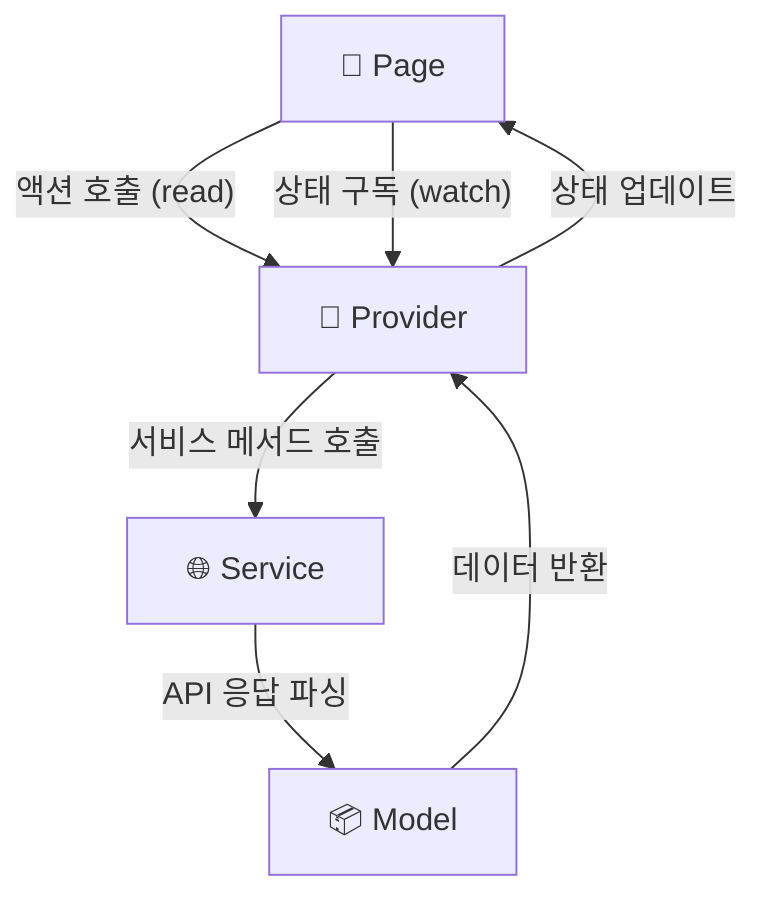
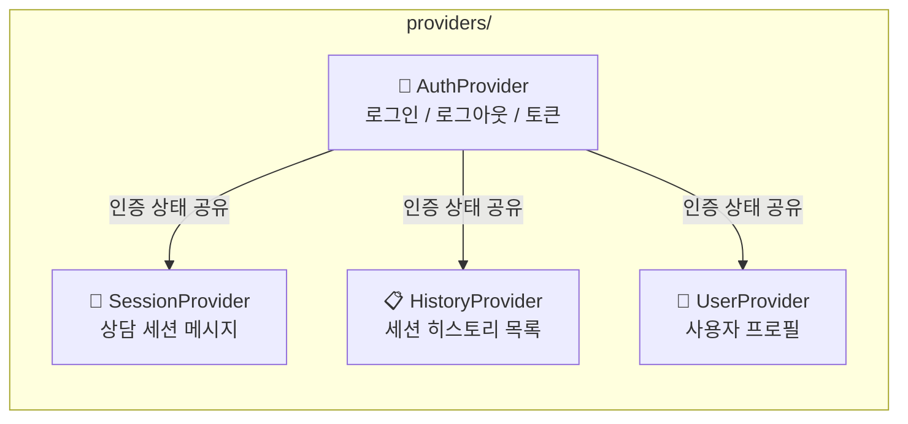
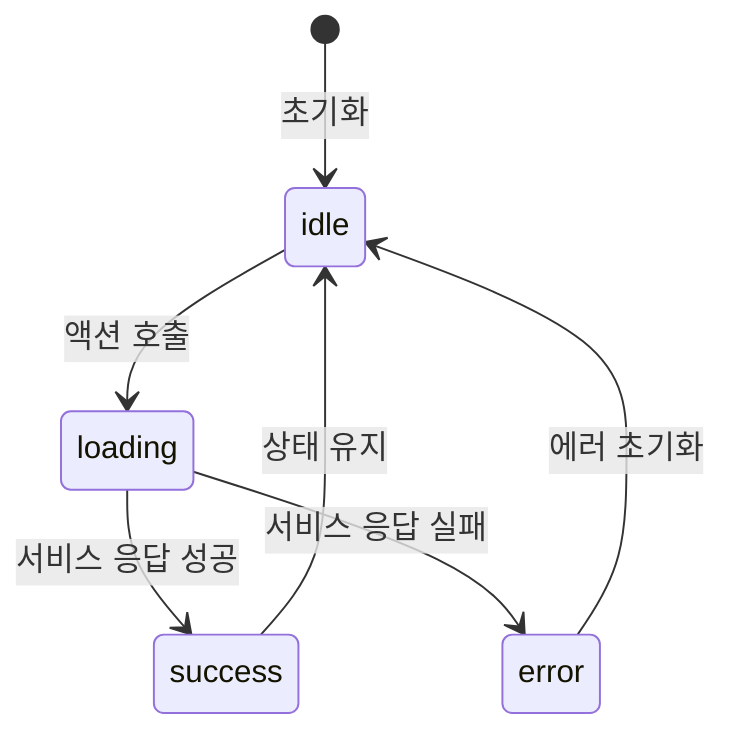

# providers/ — 상태 관리 레이어

앱 전역 및 화면별 상태를 관리합니다.  
`Pages`로부터 액션을 받아 `Services`를 호출하고, 결과 상태를 `Pages`에 노출합니다.

## Provider 데이터 흐름



## 주요 Provider 목록



## 상태 생명주기



## 폴더 구성 예시

```
providers/
├── auth_provider.dart
├── session_provider.dart
├── history_provider.dart
└── user_provider.dart
```
