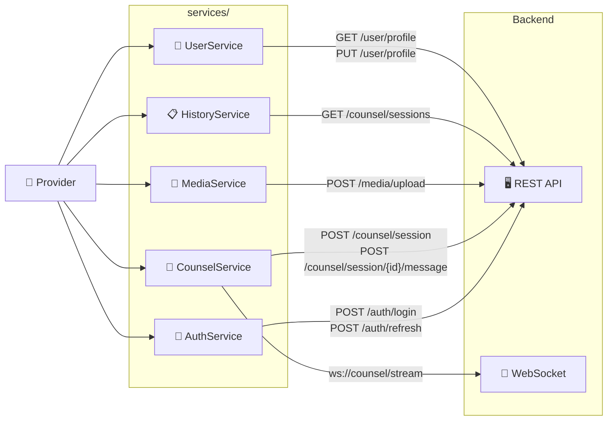
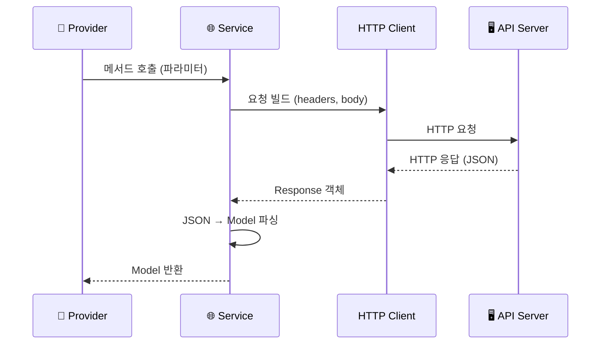
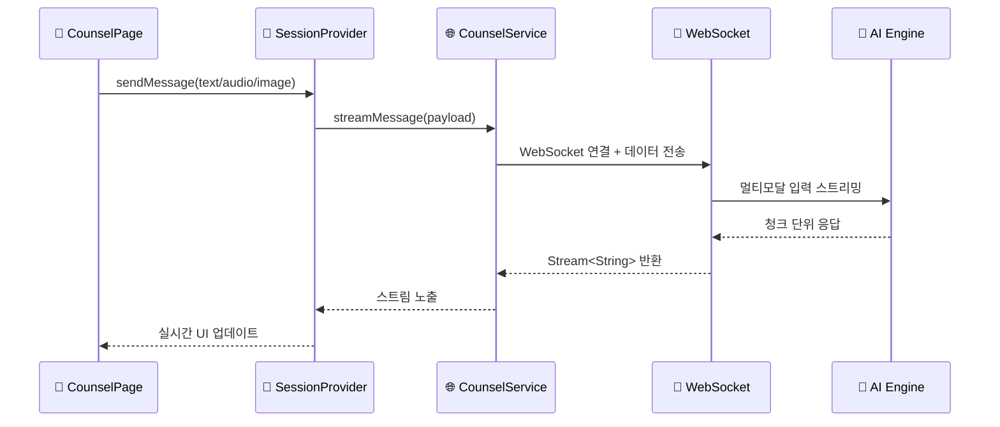

# services/ — API 통신 레이어

외부 Backend API 및 멀티모달 AI 엔진과의 모든 통신을 담당합니다.  
`Providers`로부터 호출되며, 응답을 `Models`로 파싱하여 반환합니다.

## 서비스 레이어 데이터 흐름



## HTTP 요청/응답 처리 흐름



## 멀티모달 스트리밍 흐름



## 폴더 구성 예시

```
services/
├── auth_service.dart
├── counsel_service.dart
├── media_service.dart
├── history_service.dart
└── user_service.dart
```
