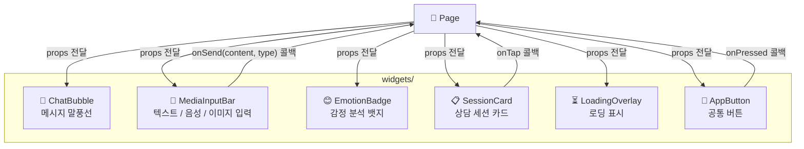
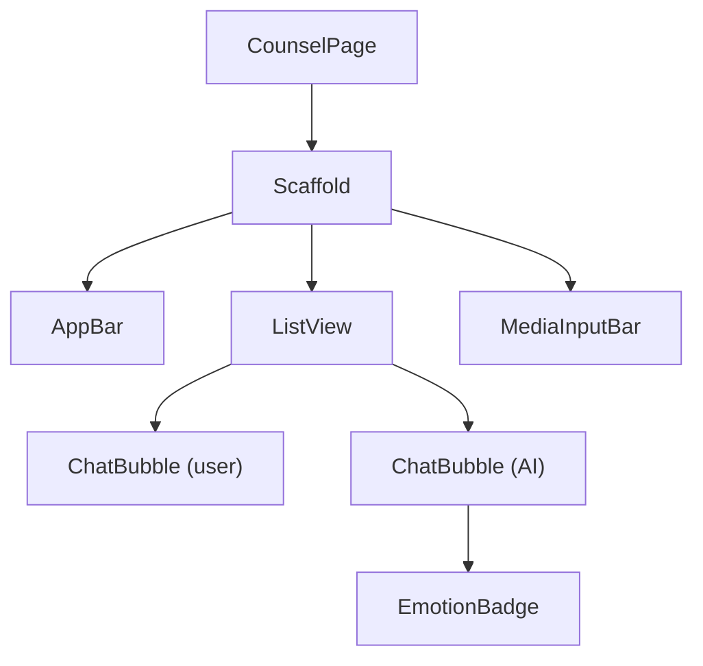

# widgets/ — 재사용 UI 컴포넌트 레이어

여러 화면에서 공유되는 UI 컴포넌트를 모아둡니다.  
`Pages`로부터 props(파라미터)를 받아 렌더링하며, 비즈니스 로직을 포함하지 않습니다.

## 위젯 사용 흐름



## 위젯 계층 구조 예시 (CounselPage)



## 폴더 구성 예시

```
widgets/
├── chat_bubble.dart
├── media_input_bar.dart
├── emotion_badge.dart
├── session_card.dart
├── loading_overlay.dart
└── app_button.dart
```
